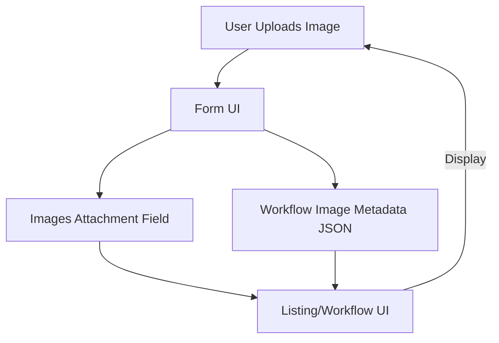
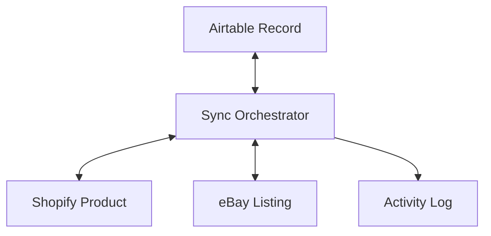

# Architecture & Data Flow Diagrams

Below are Mermaid diagrams illustrating the high-level architecture and data flow for the Airtable-Shopify-eBay Sync app.

## App Architecture

```mermaid
graph TD
    A[Frontend (React)] -->|REST| B(Airtable API)
    A -->|REST| C(Shopify API)
    A -->|REST| D(eBay API)
    A -->|Webhooks| E(Node.js/Express Backend)
    E -->|DB| F[(SQLite/PostgreSQL)]
    E -->|Sync| B
    E -->|Sync| C
    E -->|Sync| D
```

## Workflow Image Metadata Flow



## Listing Sync Flow


```
