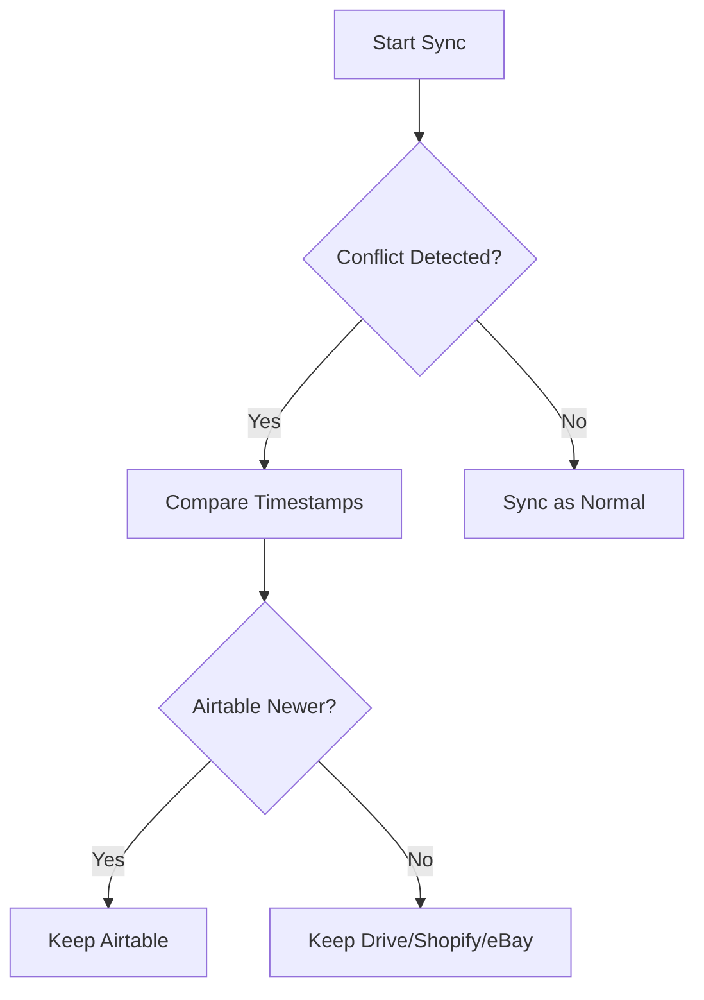

# Sync Conflict Resolution Flow (Mermaid)

```mermaid
graph TD
    A[Start Sync] --> B{Conflict Detected?}
    B -- Yes --> C[Compare Timestamps]
    C --> D{Airtable Newer?}
    D -- Yes --> E[Keep Airtable]
    D -- No --> F[Keep Drive/Shopify/eBay]
    B -- No --> G[Sync as Normal]
```
