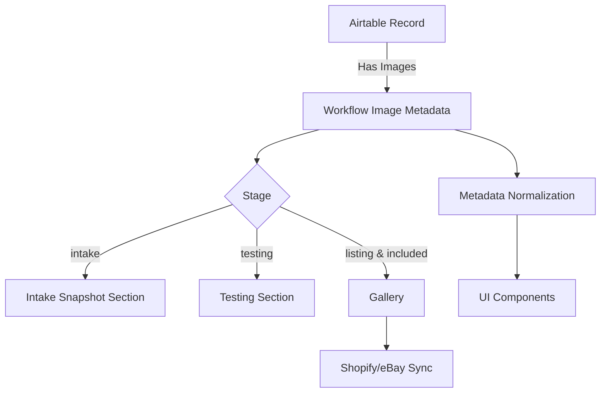
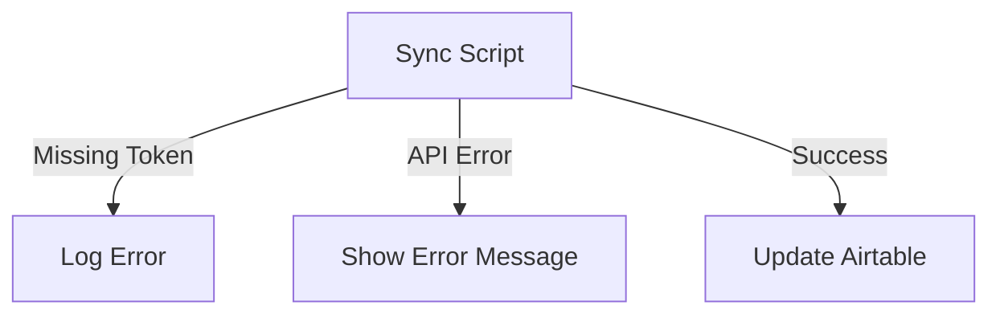

# Workflow Image Metadata Flow (Mermaid)

```mermaid
graph TD
    A[Airtable Record] -->|Has Images| B[Workflow Image Metadata]
    B --> C{Stage}
    C -->|intake| D[Intake Snapshot Section]
    C -->|testing| E[Testing Section]
    C -->|listing & included| F[Gallery]
    F --> G[Shopify/eBay Sync]
    B --> H[Metadata Normalization]
    H --> I[UI Components]
```

---

# Error Handling Flow (Mermaid)

```mermaid
graph TD
    X[Sync Script] -->|Missing Token| Y[Log Error]
    X -->|API Error| Z[Show Error Message]
    X -->|Success| W[Update Airtable]
```
